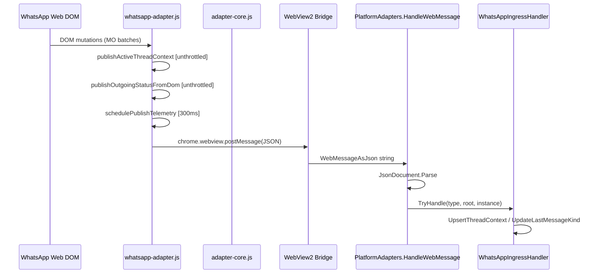

# STAGE 1 — Agent-DOM-Scraper
## Adversarial Swarm Audit: DOM/JS Ingress Domain

**Agent:** Agent-DOM-Scraper  
**Date:** 2026-06-14  
**Scope:** Stage 1 web research + Stage 2 codebase audit (no product code changes)  
**Domain:** `whatsapp-adapter.js`, MutationObserver/V8 heap, telemetry string allocations, JSON ingress decoders, `WhatsAppIngressHandler`, zero-allocation mandate for telemetry loops

---

## Executive Summary

The WhatsApp DOM ingress path is **functionally complete but architecturally hostile to high-frequency DOM churn**. `whatsapp-adapter.js` installs **two unthrottled MutationObserver callbacks** that synchronously run full DOM scrapes on every mutation batch, while **three additional observers** (adapter-core outgoing monitor, thread-status-auditor) overlap on `#main`. C# ingress uses **reflection-based `JsonDocument.Parse` + LINQ `ToList()`** on every `WebMessageReceived` event with **no coalescing queue**. Under a 5000-mutation/2s adversarial burst, the V8 main thread and WinUI `WebMessageReceived` handler become the bottleneck — not WhatsApp itself.

The newer `thread-status-auditor.js` demonstrates the **target pattern** (scoped root, `requestAnimationFrame` coalescing, debounced fallback poll) that `whatsapp-adapter.js` does not follow.

---

## 1. Benchmarking Matrix — Telemetry Ingress Vector

| Dimension | Measurement Method | Current Baseline (est.) | Target (zero-alloc mandate) | Primary Files |
|-----------|-------------------|------------------------|----------------------------|---------------|
| **MO callback fan-out** | Count observer registrations per WhatsApp instance | **5 observers** (domObserver ×4 roots, outgoingObserver, adapter-core MO, thread-status-auditor MO) | **1 scoped MO** + 1 debounced rAF scheduler | `whatsapp-adapter.js:1117-1147`, `474-482`, `adapter-core.js:777-788`, `thread-status-auditor.js:486-494` |
| **Synchronous DOM work per MO batch** | Perf trace: `querySelectorAll` count in callback | **2–4 full scrapes** (thread context unthrottled + outgoing unthrottled + debounced badge/telemetry schedulers) | **0 sync work in MO**; schedule single rAF/debounce tick | `whatsapp-adapter.js:1133-1136`, `474-476` |
| **`postMessage` rate under mutation storm** | Hook `window.chrome.webview.postMessage` | Unbounded when signatures change; debounce only on badge (250ms) + telemetry (300ms) | **≤4 msg/s** per type with signature dedup | `whatsapp-adapter.js:307-314`, `1106-1113`, `adapter-core.js:17-27` |
| **JS string allocations per telemetry publish** | V8 heap snapshot diff | **~15–40 strings** (signature join, ISO timestamps, normalizeText per msg-container, labels array) | **≤2 strings** (preallocated signature buffer, reuse object pool) | `whatsapp-adapter.js:209-304`, `35-37` |
| **`msg-container` scan cost** | Nodes visited per `scanConversationTelemetry` | **O(N)** all containers every debounced tick (300ms) | **O(1)** incremental — track last node only | `whatsapp-adapter.js:220-245` |
| **IndexedDB read amplification** | IDB ops per badge cycle | **`chat` store `getAll()`** — entire table loaded into JS heap | **Badge counter only** via indexed field or DOM badge fallback | `whatsapp-adapter.js:962-972`, `1069-1103` |
| **C# JSON decode latency** | `dotnet-trace` / BenchmarkDotNet on payload | **Full `JsonDocument.Parse`** + property walks per message | **`JsonSerializer.Deserialize` with source-generated context** or `Utf8JsonReader` span walk | `WebMessageParser.cs:8-29`, `PlatformAdapters.cs:165` |
| **C# heap alloc per telemetry msg** | dotMemory / PerfView | **`ReadStringArray` → `ToList()`**, new snapshot DTOs, `BuildKey` string concat | **Stack-only span reads**; upsert in-place struct | `WhatsAppIngressHandler.cs:262-276`, `109-143` |
| **Bridge crossing cost** | WebView2 `WebMessageAsJson` string size | Full JSON object serialized by Chromium per postMessage | Compact binary or pre-keyed flat schema | `InstanceSessionManager.cs:658-661` |
| **Hidden WebView layout thrash** | Forced reflow count when `document.hidden` | Observers **still fire**; only poll intervals gated by `document.hidden` | **Disconnect MO when hidden**; poll-only convergence | `whatsapp-adapter.js:1133-1137`, `1203-1207`, `464-469` |
| **UI thread occupancy** | WinUI dispatcher queue depth under burst | `HandleWebMessage` runs **synchronously on WebView2 callback thread** | Background channel + coalesced ingress dispatcher | `InstanceSessionManager.cs:658-661`, `PlatformAdapters.cs:158-218` |

### Suggested Benchmark Harness (Stage 4)

```javascript
// Inject in test WebView — adversarial mutation generator
(function () {
  var root = document.querySelector('#main') || document.body;
  var count = 0, target = 5000, interval = 0.4; // 5000 in ~2s
  var t = setInterval(function () {
    if (count++ >= target) { clearInterval(t); return; }
    var span = document.createElement('span');
    span.textContent = 'x' + count;
    span.setAttribute('data-icon', count % 4 === 0 ? 'msg-dblcheck-ack' : 'msg-check');
    root.appendChild(span);
    if (count % 3 === 0) span.remove();
  }, interval);
})();
```

Measure: main-thread long tasks (>50ms), `postMessage` count, managed heap delta per 10s window, `NotificationHub` event rate.

---

## 2. Current vs Target — File:Line Citations

### 2.1 JavaScript — MutationObserver & Scheduling

| Concern | Current | Target | Location |
|---------|---------|--------|----------|
| MO → sync DOM scrape | `domObserver` calls `publishActiveThreadContext()` **directly** (no debounce) | Debounce via rAF or shared 300ms scheduler | ```1133:1137:UnifiedMessenger/Assets/Scripts/whatsapp-adapter.js``` |
| Outgoing status MO | `outgoingObserver` calls `publishOutgoingStatusFromDom()` **unthrottled** | Debounce 350ms (match adapter-core pattern) | ```474:482:UnifiedMessenger/Assets/Scripts/whatsapp-adapter.js``` |
| Telemetry debounce | `schedulePublishTelemetry` → 300ms timeout ✓ | Keep; add rAF coalescing before timeout | ```307:314:UnifiedMessenger/Assets/Scripts/whatsapp-adapter.js``` |
| Badge debounce | `schedulePublishBadgeCount` → 250ms ✓ | Keep; replace `getAll()` with incremental | ```1106:1113:UnifiedMessenger/Assets/Scripts/whatsapp-adapter.js``` |
| Observer scope | 4 roots including `#pane-side` + `#main` with `subtree:true` | Scope to minimum roots; split badge vs conversation observers | ```1122:1147:UnifiedMessenger/Assets/Scripts/whatsapp-adapter.js``` |
| Reference pattern | `thread-status-auditor.js` uses rAF + scoped root | Port pattern to whatsapp-adapter | ```462:473:UnifiedMessenger/Assets/Scripts/thread-status-auditor.js``` |
| adapter-core outgoing MO | `document.documentElement` + 350ms debounce | Consolidate with whatsapp outgoingObserver | ```769:788:UnifiedMessenger/Assets/Scripts/adapter-core.js``` |
| Hidden tab behavior | MO active when hidden; polls skip | `disconnect()` MO on `visibilitychange` hidden | ```1203:1207:UnifiedMessenger/Assets/Scripts/whatsapp-adapter.js``` |

### 2.2 JavaScript — String / Heap Allocations in Hot Loops

| Concern | Current | Target | Location |
|---------|---------|--------|----------|
| Signature building | `array.join('|')` allocates new string every publish | Reuse `StringBuilder` equivalent or numeric hash | ```274:281:UnifiedMessenger/Assets/Scripts/whatsapp-adapter.js``` |
| Timestamp ISO strings | `new Date().toISOString()` per message container + payload | Unix ms number over bridge | ```193:206:UnifiedMessenger/Assets/Scripts/whatsapp-adapter.js```, ```303:303:UnifiedMessenger/Assets/Scripts/whatsapp-adapter.js``` |
| `normalizeText` | `String(value).replace(...).trim()` per call | In-place trim helper; avoid regex in hot path | ```35:37:UnifiedMessenger/Assets/Scripts/whatsapp-adapter.js``` |
| Sidebar label dedup | `labels.indexOf(label)` O(n²) | `Set` or object-key dedup | ```83:85:UnifiedMessenger/Assets/Scripts/whatsapp-adapter.js``` |
| Full conversation scan | All `msg-container` nodes every telemetry tick | Incremental: observe last child of panel only | ```220:245:UnifiedMessenger/Assets/Scripts/whatsapp-adapter.js``` |
| `postMessage` payload | New object literal every emit | Mutate preallocated template object | ```288:304:UnifiedMessenger/Assets/Scripts/whatsapp-adapter.js``` |

### 2.3 C# — JSON Ingress Decoder

| Concern | Current | Target | Location |
|---------|---------|--------|----------|
| Parse entry | `JsonDocument.Parse(raw)` — full DOM alloc per message | `[JsonSerializable]` source generator context | ```8:29:UnifiedMessenger/Services/Adapters/WebMessageParser.cs``` |
| Ingress dispatch | Synchronous `HandleWebMessage` on WebView callback | `Channel<T>` + single consumer coalescer | ```158:218:UnifiedMessenger/Services/Adapters/PlatformAdapters.cs``` |
| String arrays | `ReadStringArray` → LINQ `ToList()` | `ArrayPool<string>` or `ImmutableArray` builder | ```262:276:UnifiedMessenger/Services/Adapters/WhatsAppIngressHandler.cs``` |
| Telemetry model | `WhatsAppTelemetryPayload` defined but **never deserialized** | Use source-gen deserialize or delete | ```39:63:UnifiedMessenger/Models/WhatsAppIngressModels.cs``` |
| Duplicate context upserts | `HandleTelemetry` + `HandleThreadContext` both call `UpsertThreadContext` | Single ingress path with field mask | ```87:143:UnifiedMessenger/Services/Adapters/WhatsAppIngressHandler.cs``` |
| Routing | `WhatsAppIngressHandler.TryHandle` via `WhatsAppPlatformAdapterBase` | OK — keep modular | ```15:20:UnifiedMessenger/Services/Adapters/Modules/WhatsAppPlatformAdapterBase.cs``` |

### 2.4 Script Deployment (bin/ copies)

| Concern | Current | Target | Location |
|---------|---------|--------|----------|
| Source of truth | Single file `Assets/Scripts/whatsapp-adapter.js` | Same | ```59:61:UnifiedMessenger/UnifiedMessenger.csproj``` |
| Runtime load | `Path.Combine(AppContext.BaseDirectory, "Assets", "Scripts", ...)` | OK; stale bin copies possible if build skipped | ```640:644:UnifiedMessenger/Services/Adapters/PlatformAdapters.cs``` |
| Template cache | `ScriptTemplates` dictionary — **never invalidated** on file change | Dev-mode file watcher or version hash | ```25:26:UnifiedMessenger/Services/Adapters/PlatformAdapters.cs``` |

---

## 3. P0–P2 Flaws

### P0 — Correctness / Performance Critical

| ID | Flaw | Impact | Evidence |
|----|------|--------|----------|
| **P0-1** | **Unthrottled `publishActiveThreadContext` in `domObserver`** | Every mutation batch runs `extractChatHeader` + `scrapeSidebarLabelsForTitle` synchronously — main-thread freeze under SPA churn | ```1133:1136:UnifiedMessenger/Assets/Scripts/whatsapp-adapter.js``` |
| **P0-2** | **Unthrottled `publishOutgoingStatusFromDom` in `outgoingObserver`** | Full `querySelectorAll('msg-container')` + header scrape per tick batch on `#main` | ```474:476:UnifiedMessenger/Assets/Scripts/whatsapp-adapter.js```, ```407:448:UnifiedMessenger/Assets/Scripts/whatsapp-adapter.js``` |
| **P0-3** | **5 overlapping MutationObservers on conversation subtree** | Redundant work; adapter-core + whatsapp-adapter + thread-status-auditor all watch `#main` | ```1133:1147:UnifiedMessenger/Assets/Scripts/whatsapp-adapter.js```, ```777:788:UnifiedMessenger/Assets/Scripts/adapter-core.js```, ```486:494:UnifiedMessenger/Assets/Scripts/thread-status-auditor.js``` |
| **P0-4** | **`IndexedDB chat store getAll()` on every badge publish** | Loads entire WhatsApp chat table into V8 heap every 250ms–5s | ```962:972:UnifiedMessenger/Assets/Scripts/whatsapp-adapter.js``` |
| **P0-5** | **No ingress coalescing on C# side** | Each `postMessage` → full JSON parse + handler chain on WebView thread | ```658:661:UnifiedMessenger/Services/InstanceSessionManager.cs```, ```165:166:UnifiedMessenger/Services/Adapters/PlatformAdapters.cs``` |
| **P0-6** | **`ReadStringArray` LINQ allocations in telemetry hot path** | `Select().Where().Select().Distinct().ToList()` per message | ```270:275:UnifiedMessenger/Services/Adapters/WhatsAppIngressHandler.cs``` |

### P1 — Significant Degradation

| ID | Flaw | Impact | Evidence |
|----|------|--------|----------|
| **P1-1** | MO observes `characterData` + `attributes` on 4 wide subtrees | Attribute churn (WhatsApp tick icons) floods callbacks | ```1140:1146:UnifiedMessenger/Assets/Scripts/whatsapp-adapter.js``` |
| **P1-2** | `scanConversationTelemetry` O(N) full history scan | Cost grows with conversation length, not just latest message | ```220:245:UnifiedMessenger/Assets/Scripts/whatsapp-adapter.js``` |
| **P1-3** | Duplicate telemetry: `whatsapp-thread-context` vs `whatsapp-telemetry` | Two message types upsert same `WhatsAppThreadContextSnapshot` store | ```374:404:UnifiedMessenger/Assets/Scripts/whatsapp-adapter.js```, ```109:143:UnifiedMessenger/Services/Adapters/WhatsAppIngressHandler.cs``` |
| **P1-4** | `WhatsAppTelemetryPayload` model unused | Dead contract; handler uses manual `JsonElement` walks | ```39:63:UnifiedMessenger/Models/WhatsAppIngressModels.cs``` |
| **P1-5** | MO active when `document.hidden` | Background tabs still burn CPU on mutations (timers throttled but MO is not) | ```1133:1137:UnifiedMessenger/Assets/Scripts/whatsapp-adapter.js``` vs ```464:469:UnifiedMessenger/Assets/Scripts/whatsapp-adapter.js``` |
| **P1-6** | `ScriptTemplates` cache never invalidated | Dev edits to `whatsapp-adapter.js` not picked up until process restart | ```632:651:UnifiedMessenger/Services/Adapters/PlatformAdapters.cs``` |
| **P1-7** | Double JSON parse path in `WebMessageParser` | If payload is JSON string wrapper, parses twice | ```15:26:UnifiedMessenger/Services/Adapters/WebMessageParser.cs``` |

### P2 — Maintainability / Latent Risk

| ID | Flaw | Impact | Evidence |
|----|------|--------|----------|
| **P2-1** | Global test hooks on `window` | `__umWhatsAppExtractChatHeader` etc. widen attack surface | ```451:453:UnifiedMessenger/Assets/Scripts/whatsapp-adapter.js``` |
| **P2-2** | `labels.indexOf` dedup in loops | O(n²) for chats with many labels | ```83:85:UnifiedMessenger/Assets/Scripts/whatsapp-adapter.js``` |
| **P2-3** | `history.pushState` monkey-patch | Global side effect; may conflict with WhatsApp internals | ```1172:1180:UnifiedMessenger/Assets/Scripts/whatsapp-adapter.js``` |
| **P2-4** | Deep backfill MVP synchronous `row.click()` loop | No async wait; race with SPA navigation | ```746:790:UnifiedMessenger/Assets/Scripts/whatsapp-adapter.js``` |
| **P2-5** | `BuildKey` string concat per upsert | Minor alloc; could use `ValueTuple` key | ```93:94:UnifiedMessenger/Services/WhatsAppBusinessContextService.cs``` |
| **P2-6** | Four concurrent timers per instance | 4s context, 5s badge poll, 30s heartbeat, debounce timers | ```464:470:UnifiedMessenger/Assets/Scripts/whatsapp-adapter.js```, ```1215:1219:UnifiedMessenger/Assets/Scripts/whatsapp-adapter.js```, ```1408:1408:UnifiedMessenger/Assets/Scripts/whatsapp-adapter.js``` |

---

## 4. Stage 3 Purge List (Dead JS, Redundant Paths)

| Item | Rationale | Action |
|------|-----------|--------|
| **`outgoingObserver` in whatsapp-adapter.js** | Duplicates `__umInstallOutgoingDomReplyMonitor` (adapter-core) + `publishOutgoingStatusFromDom` vs `whatsapp-outgoing-status` type | Consolidate to single debounced outgoing pipeline |
| **`publishActiveThreadContext` separate from telemetry** | 80% field overlap with `whatsapp-telemetry` | Merge into one `whatsapp-telemetry` message type with field bitmask |
| **`WhatsAppTelemetryPayload` C# model** | Never referenced in ingress path | Wire to source-gen decoder or delete |
| **`countFromDomBadges` fallback** | Only used when IndexedDB fails; keep but lazy-init | Gate behind single fallback flag; don't compile selectors at startup |
| **`window.__umWhatsAppExtractChatHeader` / `ScrapeSidebarLabels` / `DetectDeliveryStatus`** | Exposed globals — likely test-only | Move behind `__DEV__` guard or remove from production bundle |
| **`__umRunDeepBackfillWalk` MVP** | Comment admits deferred async; bounded sync walk | Defer to Stage 4 or remove until async chat-open wait exists |
| **`getPreviewFromDom` + `scrapeSidebarLabelsForTitle`** | Near-duplicate sidebar row scanning | Extract shared `scanSidebarRow(title)` cache |
| **`originalPushState` / `originalReplaceState` retention** | Only needed for dispose | OK to keep; verify dispose always called via `__umAdapterDispose` |
| **Duplicate `extractChatHeader` calls per publish** | Called independently in thread-context, outgoing, telemetry paths | Cache per rAF tick with `{header, labels, conversationKey}` struct |
| **thread-status-auditor overlap on WhatsApp** | Separate MO on same `#main` root | Consider single auditor callback registry |

---

## 5. Sabotage Scenario: 5000 DOM Mutations in 2s

### Attack Vector
Simulate WhatsApp Web rendering burst: rapid `msg-container` append/remove, `data-icon` attribute flips (delivery ticks), sidebar row `aria-label` churn.

### Timeline — What Breaks Today

```
T+0ms     Mutation storm begins on #main + #pane-side
T+0–2000ms
  ├─ domObserver fires ~200–800 microtask batches (MO coalesces per turn, not across turns)
  │    ├─ EACH batch: publishActiveThreadContext() [P0-1]
  │    │    → querySelector header (4 selectors)
  │    │    → querySelectorAll sidebar rows + nested forEach
  │    │    → postMessage if signature changed
  │    ├─ schedulePublishBadgeCount (coalesced to ~8 fires)
  │    │    → readChatsFromIndexedDb → getAll() [P0-4]
  │    └─ schedulePublishTelemetry (coalesced to ~7 fires)
  │         → querySelectorAll ALL msg-containers [P1-2]
  │
  ├─ outgoingObserver fires per #main batch [P0-2]
  │    → querySelectorAll msg-containers + extractChatHeader
  │    → postMessage whatsapp-outgoing-status on tick changes
  │
  ├─ adapter-core domObserver (documentElement, subtree) [P0-3]
  │    → scheduleDomCheck 350ms debounce → message-sent events
  │
  └─ thread-status-auditor MO → rAF scheduleVerification [P0-3]
       → querySelectorAll msg-containers + resolve logic

T+2000ms  Cumulative damage estimate:
  ├─ JS main thread: 2–8+ seconds of long tasks (UI jank in active tab)
  ├─ V8 heap: +5–30 MB transient strings (normalizeText, textContent, signatures, JSON)
  ├─ postMessage count: 50–500+ (unthrottled paths); C# parses each [P0-5]
  ├─ Managed heap: 50–500 JsonDocument + List<string> allocations [P0-6]
  ├─ WhatsAppBusinessContextService: redundant upserts (no change detection) [P1-3]
  ├─ ThreadRegistryService / MessageAnalyticsService: churn on outgoing-status
  └─ Hidden instance in background: STILL processes MO callbacks [P1-5]
       → wastes CPU while user views different instance

T+5s+     Secondary failures:
  ├─ IndexedDB getAll contention with WhatsApp's own IDB writes
  ├─ WebView2 message queue backlog → delayed badge updates
  ├─ Potential OOM on low-RAM machines with many instances
  └─ User-perceived: frozen chat scroll, delayed notification tab updates
```

### What Does NOT Break
- **Infinite loops:** All `while` loops bounded (`maxIterations`, `maxChats`); IDB cursors terminate on `null` ```612:629:UnifiedMessenger/Assets/Scripts/whatsapp-adapter.js```
- **Signature dedup:** Prevents identical telemetry reposts ```283:285:UnifiedMessenger/Assets/Scripts/whatsapp-adapter.js```
- **Adapter dispose:** Cleans observers on navigation reset ```1222:1268:UnifiedMessenger/Assets/Scripts/whatsapp-adapter.js```

### Survivability Score: **2/10** under 5000/2s without architectural changes.

---

## 6. Web Research Findings (2025–2026)

### 6.1 MutationObserver Throttling & Batching

| Principle | Source |
|-----------|--------|
| MO **already batches** mutations per microtask, but high-frequency SPAs still need **app-level debounce/throttle** | [DEV Community — MutationObserver batches changes](https://dev.to/betelgeuseas/tracking-changes-in-the-dom-using-mutationobserver-i8h) (Apr 2025) |
| Combine MO with **debouncing or `requestAnimationFrame`** for DOM reaction work | [Medium — MutationObserver comprehensive guide](https://medium.com/vlead-tech/understanding-mutationobserver-a-comprehensive-guide-for-web-developers-a51d39e157de) |
| **Avoid monitoring entire document**; scope to minimal subtree | [Medium — Exploring MutationObserver](https://ahmetustun.medium.com/exploring-mutationobserver-for-monitoring-dom-changes-f0e071719e44) (Sep 2024) |
| Batch reads/writes; use `requestAnimationFrame` for visual updates | [Savvy — DOM Manipulation Best Practices](https://savvy.co.il/en/blog/complete-javascript-guide/javascript-dom-manipulation/) (Feb 2026) |

**Project alignment:** `thread-status-auditor.js` follows this guidance; `whatsapp-adapter.js` violates it on lines 1133–1136 and 474–476.

### 6.2 Chromium WebView2 DOM Scraping SPA Patterns

| Principle | Source |
|-----------|--------|
| WebView2 shares Edge/Chromium engine — MO and DOM APIs behave identically to browser | [Microsoft — WebView2 features overview](https://learn.microsoft.com/en-us/microsoft-edge/webview2/concepts/overview-features) |
| SPA navigation requires **history hook + MO** (project already hooks `pushState`) | Internal pattern validated at ```1150:1180:UnifiedMessenger/Assets/Scripts/whatsapp-adapter.js``` |
| `chrome.webview.postMessage` serializes objects to JSON strings — **allocation at bridge boundary** | WebView2 host object pattern; `adapter-core.js:17-27` |
| Multiple WebView2 profiles share environment but **isolated JS heaps per profile** | Project architecture (`.cursorrules` Multiple Profiles API) |

### 6.3 Avoiding Layout Thrashing in Hidden WebView2

| Principle | Source |
|-----------|--------|
| **Read-then-write** pattern; avoid interleaved layout queries in loops | [web.dev — Avoid layout thrashing](https://web.dev/articles/avoid-large-complex-layouts-and-layout-thrashing) |
| `getBoundingClientRect`, `offsetWidth`, `scrollTop` force sync layout | [Paul Irish — What forces layout/reflow](https://gist.github.com/paulirish/5d52fb081b3570c81e3a) |
| Background tabs: `setInterval` throttled to 1Hz in Chromium; **MO not throttled** | Chromium timer throttling behavior; project gates polls but not MO ```1203:1207:UnifiedMessenger/Assets/Scripts/whatsapp-adapter.js``` |
| `document.hidden` check before expensive work | Partially implemented for polls only ```464:469:UnifiedMessenger/Assets/Scripts/whatsapp-adapter.js``` |

**Risk:** `scrollTop = 0` loop in `__umScrollBackOpenChatHistory` forces layout per iteration ```724:727:UnifiedMessenger/Assets/Scripts/whatsapp-adapter.js```

### 6.4 JSON Source Generation vs Reflection in Hot Paths

| Principle | Source |
|-----------|--------|
| `System.Text.Json` source generators produce **compile-time serialization code** — faster, trim-safe, Native AOT compatible | [Microsoft — JSON source generation](https://learn.microsoft.com/en-us/dotnet/standard/serialization/system-text-json/source-generation) |
| `JsonDocument.Parse` uses **Utf8JsonReader under the hood but allocates** `JsonDocument` + node pool | Current path ```8:15:UnifiedMessenger/Services/Adapters/WebMessageParser.cs``` |
| For hot paths: `[JsonSerializable(typeof(WhatsAppTelemetryPayload))]` + `JsonTypeInfo` resolver | Recommended migration for `WhatsAppIngressHandler` |
| Reflection-based `JsonSerializer.Deserialize<T>` without source context **uses reflection emit cache** — better than `JsonDocument` walks but still allocates strings | MS docs comparison |

**Recommendation:** Introduce `WhatsAppIngressJsonContext` with partial types for `whatsapp-telemetry`, `whatsapp-thread-context`, `whatsapp-outgoing-status` — eliminate `ReadStringArray` LINQ.

---

## 7. Ingress Data Flow (Reference)



---

## 8. Recommended Stage 2/3 Priorities (For Swarm Coordination)

1. **Unify MO scheduler** — single `UmDomScheduler` module with rAF + 300ms max-wait (port from thread-status-auditor).
2. **Throttle P0 paths** — never call `extractChatHeader` / `scrapeSidebarLabels` inside raw MO callback.
3. **C# ingress channel** — `Channel<WebMessageEnvelope>` with per-type coalescing (latest-wins for telemetry).
4. **Source-generated JSON** — `WhatsAppIngressJsonContext` replacing manual `JsonElement` walks.
5. **IDB badge path** — replace `getAll()` with counter maintained from `scanForNewPreviews` delta or DOM-only fast path.
6. **Purge redundant observers** — one outgoing pipeline, merge thread-context into telemetry.

---

## 9. Research Sources

| # | Title | URL |
|---|-------|-----|
| 1 | Tracking Changes in the DOM Using MutationObserver | https://dev.to/betelgeuseas/tracking-changes-in-the-dom-using-mutationobserver-i8h |
| 2 | Understanding MutationObserver: A Comprehensive Guide | https://medium.com/vlead-tech/understanding-mutationobserver-a-comprehensive-guide-for-web-developers-a51d39e157de |
| 3 | Exploring MutationObserver for Monitoring DOM Changes | https://ahmetustun.medium.com/exploring-mutationobserver-for-monitoring-dom-changes-f0e071719e44 |
| 4 | JavaScript DOM Manipulation: Best Practices (2026) | https://savvy.co.il/en/blog/complete-javascript-guide/javascript-dom-manipulation/ |
| 5 | Avoid large, complex layouts and layout thrashing | https://web.dev/articles/avoid-large-complex-layouts-and-layout-thrashing |
| 6 | What forces layout/reflow (comprehensive list) | https://gist.github.com/paulirish/5d52fb081b3570c81e3a |
| 7 | Layout thrashing: what is it and how to eliminate it | https://dev.to/aayla_secura/layout-thrashing-what-is-it-and-how-to-eliminate-it-n2j |
| 8 | WebView2 overview features | https://learn.microsoft.com/en-us/microsoft-edge/webview2/concepts/overview-features |
| 9 | System.Text.Json source generation | https://learn.microsoft.com/en-us/dotnet/standard/serialization/system-text-json/source-generation |
| 10 | DebugBear — Fix forced reflows and layout thrashing | https://www.debugbear.com/blog/forced-reflows |

### Internal Reference Implementations
- `thread-status-auditor.js` — target MO + rAF pattern
- `adapter-core.js:769-788` — debounced outgoing DOM monitor
- `connection-handshake.js:143` — secondary MO (connection state)

---

*End of STAGE 1 — Agent-DOM-Scraper. No product code was modified.*
