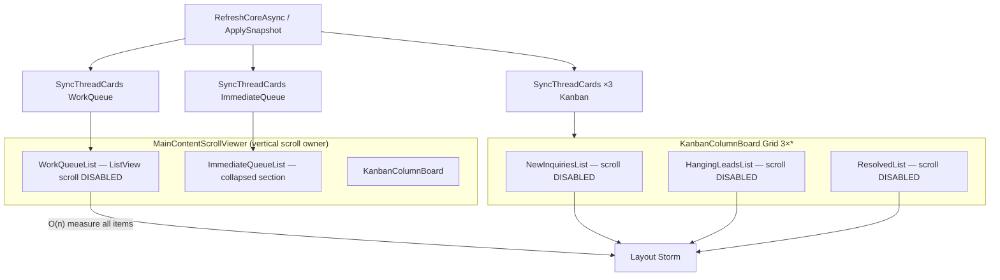

# STAGE 1 — Agent-UI-UX-Polish
## Operations Command Center: UI/UX Visual Architecture Research & Audit

**Agent:** Agent-UI-UX-Polish (Adversarial Swarm)  
**Date:** 2026-06-14  
**Scope:** Stage 1 research + Stage 2 audit only — **no product code changes**  
**Domain:** `OperationsCommandCenter.xaml` (+ partials), `OperationsThreadCardView`, `MessageVolumeLineChart`, `Themes/Controls.xaml`, High-DPI 100–200%, zero-clipping mandate

---

## Executive Summary

The OCC dashboard has a solid token foundation (`Themes/Tokens.xaml`, `Typography.xaml`, `Controls.xaml`) and selective `MinWidth="0"` usage in header and card text rows. However, **four nested `ListView` controls inside a parent `ScrollViewer` with internal scrolling disabled** create the primary layout-measurement storm vector: full materialization of all thread cards on every refresh. Chart geometry is built off-thread in `MessageVolumeLineChartHelper` but **parsed and assigned on the UI thread** on every `SizeChanged`. Semantic colors remain **split across C# hex literals, `Color.FromArgb`, and partial `UmSemanticColors`**, blocking High Contrast parity. v4.0.0 unified work-queue UX (filter chips, TeachingTip, collapsed immediate lane) ships functionally but **UIA/automation and narrow-viewport clipping** remain open P0/P1 items per the 10-minute smoke run on installed v4.0.0.

---

## 1. Benchmarking Matrix — Layout Measurement + Dispatcher Vectors

| Vector | Current Implementation | Measurement Cost | Virtualization | Dispatcher Touchpoints | Target State | Priority |
|--------|------------------------|------------------|----------------|------------------------|--------------|----------|
| **Work queue list** | `ListView` in `MainContentScrollViewer`; `ScrollViewer.VerticalScrollBarVisibility="Disabled"` on list | **O(n)** — all items measured/arranged each refresh; no viewport culling | ❌ Broken (non-scrollable ListView in outer ScrollViewer) | `ApplyWorkQueue` → `SyncThreadCards` on UI thread after `RefreshCoreAsync` | `ItemsRepeater` + `StackLayout` inside shared `ScrollViewer`; or single scroll owner with `ItemsRepeater` as sole vertical scroller | **P0** |
| **Kanban columns (×3)** | Three `ListView` per column, scroll disabled, nested in `KanbanColumnBoard` inside same outer `ScrollViewer` | **O(n×3)** worst case when board expanded | ❌ Same anti-pattern | `ApplyKanban` + drag/drop handlers; `ScrollInputHelper.EnableVerticalScrollBubbling` wired | Per-column `ItemsRepeater` OR fixed-height column `ScrollViewer` + `ItemsRepeater` (Microsoft nested-repeater pattern) | **P0** |
| **Immediate queue (legacy)** | `ImmediateLaneSection` collapsed; `ImmediateQueueList` still bound/synced | Dead UI path still pays sync cost | ❌ | `ApplyImmediateQueue` every snapshot | Remove sync when section permanently collapsed; or delete section in v4.1 | **P2** |
| **KPI metric row** | Horizontal `ScrollViewer` + fixed `Width="180"` / `MinWidth="140"` × 4 cards | O(4) — negligible | N/A (fixed count) | `ApplyStatusKpis` text updates | `MinWidth="0"` on row; tokenized `UmMetricCardMinWidth`; optional `UniformGridLayout` at wide breakpoints | **P1** |
| **Sticky OCC header** | `StackPanel` + nested `Grid`s; date pickers `MinWidth="140"` | Re-measures on date/mode toggle | N/A | Date-range debounce timer → `ScheduleDateRangeRefresh` | Single header measure pass; debounced chart refresh only | **P1** |
| **Message volume chart** | `ChartPlotGrid.SizeChanged` → `RenderChart()` → `PathGeometry` parse on UI thread | **O(points)** per resize; signature dedup helps | N/A | None (UI-thread only) | Pre-build path on background; marshal frozen `Geometry` or Win2D `CanvasComposition`; debounce `SizeChanged` 16–32 ms | **P1** |
| **Branch pill bar** | Custom control; signature-guarded rebuild | O(pills) when signature changes | N/A | `RebuildBranchPills` on refresh | Keep signature guard; add `MinWidth="0"` audit | **P2** |
| **Filter chip row** | Horizontal `StackPanel`, hardcoded `Padding="10,4"` | O(1) | N/A | `QueueFilterChip_Checked` → full `ApplyWorkQueue` | `ToggleButton` style from token; reduce full-queue rebuild to filter-only presenter pass | **P1** |
| **Thread card template** | `OperationsThreadCardView` variable height (preview 2 lines, tag row, SLA) | Per-card measure in list | Depends on parent | `x:Bind` OneTime density props | Fixed `Height` strategy for repeater OR uniform card mode for queue | **P1** |
| **Collection sync** | `ObservableCollectionSyncHelper.Sync` keyed by `ThreadId` | O(n) diff; triggers CollectionChanged → re-measure | N/A | Always UI thread | Batch updates; `ItemsRepeater` `ElementPrepared` for incremental | **P1** |

### Dispatcher Queue Map (OCC partials)

| Source | Handler | Pattern | Risk |
|--------|---------|---------|------|
| `OccQueueFilter.Changed` | `SyncQueueFilterChips` | `TryEnqueue` | Low — chip state only |
| `OccDateRangeFilter.Changed` | `ScheduleDateRangeRefresh` | Debounced timer + refresh | Medium — full snapshot |
| `OccViewMode.Changed` | View mode UI sync | `TryEnqueue` | Medium — toggles historical banner |
| `OccFilter.Changed` | Branch chip + pill sync | `TryEnqueue` | Medium |
| Backfill progress | `ApplyBackfillStatusUi` | `TryEnqueue` | Low |
| AI status | `ApplyAiStatusChip` + queue re-apply | `TryEnqueue` ×2 | **High** — may re-run `ApplyImmediateQueue`/`ApplyKanban` |
| Navigation failure | `ShowNavigationStatus` | `TryEnqueue` | Low |
| `RefreshCoreAsync` | `ApplySnapshot` | `ConfigureAwait(true)` → UI | **High** — 5 apply paths in one pass |

**Layout storm signature:** One `RefreshCoreAsync` → `ApplyKanban` + `ApplyWorkQueue` + `ApplyImmediateQueue` + KPI text + chart `ApplySeries` → up to **4 ListView collection resets** + chart geometry rebuild.

---

## 2. Current vs Target (with Citations)

### 2.1 Collection Virtualization

| Aspect | Current | Target |
|--------|---------|--------|
| Control | `ListView` ×4 (`OperationsCommandCenter.xaml` L316–337, `KanbanColumnBoard.xaml` L46–157) | `ItemsRepeater` + `StackLayout` / `UniformGridLayout` |
| Scroll ownership | Parent `ScrollViewer` (`MainContentScrollViewer`); lists disable internal scroll | **One** vertical scroll owner; Microsoft recommends wrapping `ItemsRepeater` in `ScrollViewer` ([ItemsRepeater docs](https://learn.microsoft.com/en-us/windows/apps/develop/ui/controls/items-repeater)) |
| Virtualization | Disabled when ListView cannot scroll independently ([collection controls guide](https://stevenstuartm.com/study-guides/dotnet/winui/winui-collection-controls.html)) | Layout-driven UI virtualization via `ItemsRepeater` Layout |
| Nested layout | Kanban 3-column grid + outer scroll | Nested repeaters with per-column horizontal scroll where needed ([ItemsRepeater nesting](https://learn.microsoft.com/en-us/windows/apps/develop/ui/controls/items-repeater)) |

**Citation — Microsoft Learn (Nov 2025):**
> "Unlike ListView, ItemsRepeater does not provide a comprehensive end-user experience – it has no default UI and provides no policy around focus… When you use an ItemsRepeater, you should provide scrolling functionality by wrapping it in a ScrollViewer control."

**Citation — ItemsRepeater vs ItemsControl:**
> "ItemsRepeater supports virtualizing UI layouts, while ItemsControl does not. We recommend using ItemsRepeater instead of ItemsControl."

### 2.2 High-DPI Scaling (100–200%)

| Aspect | Current | Target |
|--------|---------|--------|
| Framework scaling | WinUI 3 DIP-based layout (implicit per-monitor v2 for packaged apps) | Verify `ApplicationHighDpiMode` / manifest per-monitor v2; avoid pixel-snapped hard widths |
| Hard widths | KPI `Width="180"`, `MinWidth="140"`; DatePicker `MinWidth="140"`; chart `MinWidth="200"`; chip `MaxWidth="96"` | Replace with `{StaticResource UmMetricCardWidth}` etc.; use `*` + `MinWidth="0"` |
| Typography | Tokenized `UmFontSize*` doubles | Consider `ThemeFont` / `TextScaleFactor` hook for accessibility |
| Borders | SLA stripe `CornerRadius="2"` hardcoded in card | Token `UmCornerRadiusXs` |
| Chart stroke | `UmChartStrokeThickness` = 2.5 DIP | Snap stroke to half-DIP at 150%/175% for crisp lines ([Win2D DPI guidance](https://microsoft.github.io/Win2D/WinUI3/html/DPI.htm)) |

**Citation — DPI awareness:**
WinUI 3 desktop apps inherit system DPI awareness; physical vs DIP distinction matters for custom drawing ([Ben Stolovitz, May 2025](https://ben.stolovitz.com/posts/resize_winui_window_part_0_dpi/)). Hard-coded pixel widths **do not scale semantically** — they consume more relative space at 200%, causing horizontal clip before vertical.

### 2.3 Single-Pass Layout Measurement

| Aspect | Current | Target |
|--------|---------|--------|
| Header | Multi-level `StackPanel` (stacking measure passes) | Flatten to `Grid` rows where possible; avoid nested `StackPanel` in sticky header |
| Card sync | Collection replace triggers full ListView remeasure | `ItemsRepeater` recycling + incremental `Sync` |
| Chart | `SizeChanged` → full render path | Coalesce resize events; skip when `ActualWidth`/`ActualHeight` unchanged within ε |
| Snapshot apply | 5 sequential apply methods | Single presenter pass → one UI update batch |

### 2.4 Canvas / Geometry Off UI Thread

| Aspect | Current | Target |
|--------|---------|--------|
| Path building | `MessageVolumeLineChartHelper.Build` — pure, testable, off-thread capable | Already good |
| Geometry creation | `CreateGeometry` parses SVG-like tokens **on UI thread** in `RenderChart()` | Build `PathGeometry` on thread pool; `PathGeometry.Parse` or Win2D path → freeze → assign on UI |
| Rendering | XAML `Path` with `Stretch="None"` | Consider `Microsoft.Graphics.Canvas` + `CanvasComposition` for frequent updates ([CanvasComposition](https://microsoft.github.io/Win2D/WinUI3/html/T_Microsoft_Graphics_Canvas_UI_Composition_CanvasComposition.htm)) |
| Thread marshaling | N/A | `DispatcherQueue.TryEnqueue` for final `Path.Data` assignment only ([WinUI threading discussion](https://github.com/microsoft/microsoft-ui-xaml/discussions/8732)) |

---

## 3. P0–P2 UI Flaws (incl. v4.0.0 Work Queue UX)

Evidence: `.cursor/full-app-10min-detailed-log.txt` / `full-app-10min-detailed-summary.md` (installed **v4.0.0**, 2026-06-14).

### P0 — Ship blockers / zero-clipping mandate

| ID | Flaw | Evidence | Location |
|----|------|----------|----------|
| **P0-1** | **Nested ListView virtualization disabled** — large work queues cause layout storms and scroll jank | Architecture audit | `OperationsCommandCenter.xaml` L316–325; `KanbanColumnBoard.xaml` |
| **P0-2** | **Kanban horizontal clip at standard widths** — UIA sees 2/3 columns (Resolved column off-screen/clipped) | `WARN: OCC.Kanban \| 2/3 kanban columns visible` (cycles 2–4) | `KanbanColumnBoard.xaml` L30–35 — equal `Width="*"` columns without min-width guard or horizontal scroll |
| **P0-3** | **Work queue section label not exposed to UIA** — hurts automation & accessibility | `work-queue label=False` in StickyHeader warn | `WorkQueueSection` lacks `AutomationProperties.Name`; label is plain `TextBlock` |
| **P0-4** | **Filter chips not UIA-clickable** — v4 unified queue filters unusable in automation | `WARN: OCC.FilterChip.* \| Could not click` (all cycles) | ToggleButtons L273–299 — no `AutomationProperties.AutomationId` |

### P1 — High-impact polish

| ID | Flaw | Evidence | Location |
|----|------|----------|----------|
| **P1-1** | **Board view toggle not found via UIA** | `WARN: OCC.BoardView \| Board view toggle not found` | `BoardViewToggle` L295 — missing AutomationId |
| **P1-2** | **KPI Urgent card intermittently missing from UIA tree** | `OccKpiUrgent — card not found` (cycles 1, 4) | `MetricCardView` / scroll position; KPI row horizontal clip at narrow width |
| **P1-3** | **WorkQueueList lacks scroll bubbling** — only `ImmediateQueueList` wired | Code audit | `OperationsCommandCenter.xaml.cs` L72 — `WorkQueueList` omitted vs Immediate |
| **P1-4** | **Hardcoded chip/card paddings bypass tokens** | Code audit | `Padding="10,4"` chips; `Padding="8,2"` AI chip; `CornerRadius="2"` SLA stripe |
| **P1-5** | **Semantic colors in ViewModel bypass theme** | `Color.FromArgb(255, 220, 38, 38)` etc. | `OperationsThreadCardViewModel.cs` L49–65 |
| **P1-6** | **Chart resize storm** | `SizeChanged` undebounced | `MessageVolumeLineChart.xaml.cs` L65–66 |
| **P1-7** | **DatePicker `MinWidth="140"` ×2** — forces horizontal overflow < ~360 DIP usable width before margins | Code audit | `OperationsCommandCenter.xaml` L195–196 |
| **P1-8** | **v4 TeachingTip targets section without guaranteed first-run discoverability** | TeachingTip INFO (expected closed after first visit) — OK; but no persistent filter hint when tip dismissed | `QueueUxTeachingTip` L351–354 |

### P2 — Debt / consistency

| ID | Flaw | Evidence | Location |
|----|------|----------|----------|
| **P2-1** | **Immediate lane dead XAML path** — section `Visibility="Collapsed"` but still synced | `ApplyImmediateQueue` in every snapshot | `OperationsCommandCenter.xaml` L328–338; `Kanban.partial.cs` |
| **P2-2** | **Duplicate DataTemplates** — `OperationsWorkQueueCardTemplate` ≡ `OperationsImmediateCardTemplate` | Code audit | `OperationsCommandCenter.xaml` L13–24 |
| **P2-3** | **`AccentButtonStyle` uses `Foreground="White"`** literal | Code audit | `Themes/Controls.xaml` L42 |
| **P2-4** | **`DashboardSectionHeaderStyle` hardcodes `FontSize="13"`** outside token scale | Code audit | `Themes/Typography.xaml` L35 |
| **P2-5** | **Platform accent hex in models** — not OCC-specific but leaks into cards | `#25D366`, `#6B7280` | `PlatformDefinition.cs`, `MessengerInstance.cs` |
| **P2-6** | **Kanban column headers lack `MinWidth="0"`** | Code audit | `KanbanColumnBoard.xaml` |
| **P2-7** | **Empty-state `MaxWidth="420"`** hardcoded | Code audit | `OperationsCommandCenter.xaml` L39 |

### v4.0.0 Work Queue UX — Specific Notes

Shipped behaviors (code-verified):
- Unified **Work queue** replaces immediate lane as primary surface (`WorkQueueSection`).
- **Filter chips**: All open / Urgent / SLA / Hanging (`OccQueueFilter`).
- **Board view** optional toggle with persisted `OccBoardViewExpanded`.
- **TeachingTip** on first visit: *"One sortable queue replaces the old immediate lane…"* (`EnsureQueueTeachingTip`).

Gaps from smoke test (FAIL/WARN):
- **FAIL** cycle 2: `OCC.WorkQueue.Nav` — card click did not navigate (may be environment/data; still P1 for UX reliability).
- **FAIL** cycle 1: Kanban 0/3 visible (empty state — expected).
- Filter/board controls **fail automation** — critical for UiSmokeTests harness and accessibility audits.

---

## 4. Design Token Migration Strategy

### 4.1 Current Token Inventory

| Layer | File | Status |
|-------|------|--------|
| Brand colors | `Themes/Tokens.xaml` | ✅ `UmBrand*Color/Brush` |
| Semantic status | `Services/UmSemanticColors.cs` | ⚠️ Partial (delivery status only) |
| Presentation hex | `UnifiedMessengerDashboardPresentationHelper` | ❌ `#22C55E`, `#F59E0B`, `#EF4444`, `#64748B`, `#94A3B8` |
| ViewModel literals | `OperationsThreadCardViewModel` | ❌ `Color.FromArgb` for SLA/border |
| High contrast | `Themes/HighContrast.xaml` | ✅ Overrides brand; **missing semantic status overrides** |
| Controls | `Themes/Controls.xaml` | ✅ Mostly `ThemeResource`; one `White` literal |

### 4.2 Target Token Schema (add to `Tokens.xaml`)

```xml
<!-- Semantic status (light theme defaults) -->
<Color x:Key="UmStatusSuccessColor">#22C55E</Color>
<Color x:Key="UmStatusWarningColor">#F59E0B</Color>
<Color x:Key="UmStatusDangerColor">#DC2626</Color>
<Color x:Key="UmStatusNeutralColor">#64748B</Color>
<Color x:Key="UmStatusMutedColor">#94A3B8</Color>
<SolidColorBrush x:Key="UmStatusDangerBrush" Color="{StaticResource UmStatusDangerColor}" />
<!-- … -->

<!-- Layout tokens (DIPs) -->
<x:Double x:Key="UmMetricCardWidth">180</x:Double>
<x:Double x:Key="UmMetricCardMinWidth">140</x:Double>
<x:Double x:Key="UmDatePickerMinWidth">140</x:Double>
<x:Double x:Key="UmChartMinWidth">200</x:Double>
<x:Double x:Key="UmChipMaxWidth">96</x:Double>
<Thickness x:Key="UmFilterChipPadding">10,4</Thickness>
<Thickness x:Key="UmAiChipPadding">8,2</Thickness>
<x:Double x:Key="UmCornerRadiusXs">2</x:Double>
```

### 4.3 Migration Phases

| Phase | Action | Files | Risk |
|-------|--------|-------|------|
| **A — Token define** | Add semantic + layout tokens; mirror in `HighContrast.xaml` | `Tokens.xaml`, `HighContrast.xaml` | Low |
| **B — StaticResource in XAML** | Replace hardcoded `Padding`, `Width`, `MinWidth`, `MaxWidth`, `CornerRadius` in OCC/chart/kanban | OCC XAML, `MessageVolumeLineChart.xaml` | Low |
| **C — Brush lookup helper** | Extend `UmSemanticColors` → `UmSemanticBrushes.Get(string key)` returning frozen brushes from Application resources | New small service | Medium |
| **D — ViewModel refactor** | Replace `Color.FromArgb` / `CreateBrush(hex)` with resource lookups; keep hex resolver for unit tests mapping names→keys | `OperationsThreadCardViewModel`, `UnifiedMessengerDashboardPresentationHelper` | Medium |
| **E — Platform accents** | Map `PlatformDefinition.AccentColor` to nearest brand/platform token | Models | Low |
| **F — Validation** | Snapshot tests for brush keys; UiSmokeTests at 100/150/200% | Test projects | Required for zero-clipping sign-off |

### 4.4 Rules of Engagement

1. **No hex in XAML or ViewModels** after Phase D — only `{StaticResource}` / `{ThemeResource}`.
2. **Frozen brushes** — cache at app startup to avoid per-card allocation storm (current `new SolidColorBrush` per card in ViewModel ctor).
3. **High Contrast** must override every semantic token (WCAG non-text contrast 3:1 for SLA borders).

---

## 5. Pixel-Alignment / Clipping Test Matrix (per DPI)

| Scenario | 100% (96 DPI) | 125% (120 DPI) | 150% (144 DPI) | 200% (192 DPI) | Pass Criteria |
|----------|---------------|----------------|----------------|----------------|---------------|
| **OCC min window width (~640 DIP)** | KPI row scrolls horizontally | Same | Date pickers may clip without wrap | KPI + chips clip; filter row overflows | No text truncated without ellipsis; horizontal scroll visible where intended |
| **Scope line + AI chip** | `ScopeText` ellipsis works (`MinWidth="0"`) | OK | `MaxWidth="96"` chip may truncate AI label | Chip unreadable | Chip uses `TextWrapping` or adaptive width token |
| **Work queue 50+ cards** | Scroll smooth | Measure jank likely | Severe jank | Unusable | ≤16 ms frame budget during scroll (after ItemsRepeater migration) |
| **Kanban 3 columns** | All 3 visible ≥900 DIP | 2.5 visible | 2/3 visible ( **observed in smoke test** ) | 1–2 columns | Horizontal `ScrollViewer` on board OR responsive 1-column stack |
| **Thread card — long customer name** | Ellipsis | OK | OK | OK | No overlap with urgency badge |
| **Thread card — tag row** | Horizontal wrap absent — clip | Secondary tags clip | Clip | Clip | Wrap or overflow scroll |
| **Chart axis labels** | Start/end visible | OK | OK | Stroke 2.5 may blur | Crisp line at half-DIP snap |
| **Filter chips (5 toggles)** | Fit on one row | Fit | May wrap off-screen | Overflow | Second row wrap panel or scroll |
| **TeachingTip (first run)** | Visible | OK | OK | OK | Not clipped by sticky header |
| **Empty state** | Centered | OK | OK | OK | `MaxWidth` from token |
| **High Contrast theme** | SLA red visible | Yellow HC mapping | Borders distinguishable | Same | Semantic tokens mapped in HC dictionary |

### Recommended UiSmokeTests additions

- Set display scale via `UIAutomation` / launch args / registry scale factor before OCC probes.
- Assert `AutomationId` on: `WorkQueueList`, filter chips, `BoardViewToggle`, all KPI cards.
- Capture `BoundingRectangle` for kanban columns — fail if `Resolved` column rect width = 0.

---

## 6. Hardcoded Hex / Color Audit (OCC Domain)

| Location | Value | Purpose | Token Target |
|----------|-------|---------|--------------|
| `OperationsThreadCardViewModel.cs:50` | `220,38,38` | SLA/revenue border | `UmStatusDangerColor` |
| `OperationsThreadCardViewModel.cs:64` | `245,158,11` | SLA warning | `UmStatusWarningColor` |
| `OperationsThreadCardViewModel.cs:65` | `100,116,139` | SLA neutral | `UmStatusNeutralColor` |
| `UnifiedMessengerDashboardPresentationHelper` | `#DC2626/#F59E0B/#64748B` | Urgency | Semantic tokens |
| `UnifiedMessengerDashboardPresentationHelper` | `#22C55E/#F59E0B/#EF4444/#94A3B8` | Sentiment/latency | Semantic tokens |
| `UmSemanticColors.cs` | `#2563EB/#64748B/#94A3B8` | Delivery status | Extend token set |
| `Controls.xaml:42` | `White` | Accent button FG | `TextOnAccentFillColorPrimaryBrush` |
| `MessageVolumeLineChart.xaml` | — | Uses `UmBrandTealBrush` ✅ | — |

**XAML hardcoded dimensions (non-color):** see P1-4, P1-7, P2-7 tables above.

---

## 7. Layout Architecture Diagram (Current)



---

## 8. Research Sources

### Microsoft / Official

1. [ItemsRepeater — Windows apps \| Microsoft Learn](https://learn.microsoft.com/en-us/windows/apps/develop/ui/controls/items-repeater) — virtualization, ScrollViewer wrapping, nesting (scraped 2026-06-14 → `.crawl4ai/ms-items-repeater.md`)
2. [ItemsRepeater class API](https://learn.microsoft.com/en-us/windows/windows-app-sdk/api/winrt/microsoft.ui.xaml.controls.itemsrepeater)
3. [WinUI 3 overview](https://learn.microsoft.com/en-us/windows/apps/winui/winui3/)
4. [WinUI 3 DPI awareness Q&A](https://learn.microsoft.com/en-us/answers/questions/1356293/winui3-are-winui3-desktop-application-dpi-aware-by)

### Community / Technical

5. [Collection Controls in WinUI 3 — Steven Stuart](https://stevenstuartm.com/study-guides/dotnet/winui/winui-collection-controls.html) — ListView VirtualizingStackPanel vs ItemsRepeater
6. [WinUI 3 ItemsRepeater masonry / variable height (Dec 2025)](https://en.ittrip.xyz/c-sharp/winui3-itemsrepeater-masonry)
7. [Programmatic scroll to virtualized item — Stack Overflow](https://stackoverflow.com/questions/78403328/winui-3-programmatic-scroll-to-virtualized-item-in-itemscontrol-not-listview)
8. [ItemsRepeater layout orientation change issue #9422](https://github.com/microsoft/microsoft-ui-xaml/issues/9422)
9. [WinUI threading / DispatcherQueue discussion #8732](https://github.com/microsoft/microsoft-ui-xaml/discussions/8732)
10. [Win2D DPI and DIPs](https://microsoft.github.io/Win2D/WinUI3/html/DPI.htm)
11. [CanvasComposition — Win2D](https://microsoft.github.io/Win2D/WinUI3/html/T_Microsoft_Graphics_Canvas_UI_Composition_CanvasComposition.htm)
12. [DPI-aware window sizing — Ben Stolovitz (May 2025)](https://ben.stolovitz.com/posts/resize_winui_window_part_0_dpi/)
13. [WindowSizeLimiterWinUI3 — DPI-aware min/max](https://github.com/MEHDIMYADI/WindowSizeLimiterWinUI3)

### Internal / Project Evidence

14. `.cursor/full-app-10min-detailed-summary.md` — v4.0.0 smoke totals (OCC: 77 pass, 32 warn, 2 fail)
15. `.cursor/full-app-10min-detailed-log.txt` — per-cycle OCC UIA warnings
16. Codebase files cited inline above

### Search Artifacts (Crawl4AI)

- `.crawl4ai/search-winui-virtualization.json`
- `.crawl4ai/search-winui-dpi.json`
- `.crawl4ai/search-winui-geometry.json`
- `.crawl4ai/search-winui-listview-repeater.json`
- `.crawl4ai/ms-items-repeater.md`

---

## 9. Recommended Stage 2→3 Handoff (No Code — For Swarm Coordination)

| Workstream | Owner suggestion | Depends on |
|------------|------------------|------------|
| ItemsRepeater migration (work queue first) | Agent-Performance | This audit P0-1 |
| Kanban horizontal scroll / responsive columns | Agent-UI-UX-Polish | P0-2 |
| AutomationId pass (filter chips, board toggle, section labels) | Agent-A11y | P0-3, P0-4, P1-1 |
| Semantic token Phase A–D | Agent-UI-UX-Polish | §4 |
| Chart geometry off-UI-thread | Agent-Performance | §2.4 |
| Remove immediate lane dead path | Agent-Feature-Cleanup | P2-1 |

---

## 10. Files Audited

| File | Lines (approx) | Notes |
|------|----------------|-------|
| `Controls/OperationsCommandCenter.xaml` | 368 | Primary layout; ListView anti-pattern |
| `Controls/OperationsCommandCenter.xaml.cs` | 498 | Dispatcher, scroll wiring gap |
| `Controls/OperationsCommandCenter.*.partial.cs` | 7 files | Queue/KPI/Kanban/DateRange/ViewMode |
| `Controls/Shared/OperationsThreadCardView.xaml` | 129 | Good MinWidth=0 on text |
| `Controls/Shared/OperationsThreadCardView.xaml.cs` | 138 | Density tokens partial |
| `Controls/Shared/MetricCardView.xaml` | 81 | Interactive states OK |
| `Controls/KanbanColumnBoard.xaml` | 179 | 3× nested ListView |
| `Controls/MessageVolumeLineChart.xaml` | 60 | Token brushes ✅ |
| `Controls/MessageVolumeLineChart.xaml.cs` | 168 | UI-thread geometry |
| `Themes/Tokens.xaml` | 70 | Brand only, no semantic |
| `Themes/Controls.xaml` | 75 | One White literal |
| `Themes/Typography.xaml` | 79 | UmEllipsisTextStyle ✅ |
| `Services/UmSemanticColors.cs` | 13 | Incomplete |
| `Services/UnifiedMessengerDashboardPresentationHelper.cs` | 84 | Hex resolver |
| `Controls/OperationsThreadCardViewModel.cs` | 207 | Brush allocation per card |

---

*End of STAGE 1 — Agent-UI-UX-Polish. No product code was modified.*
